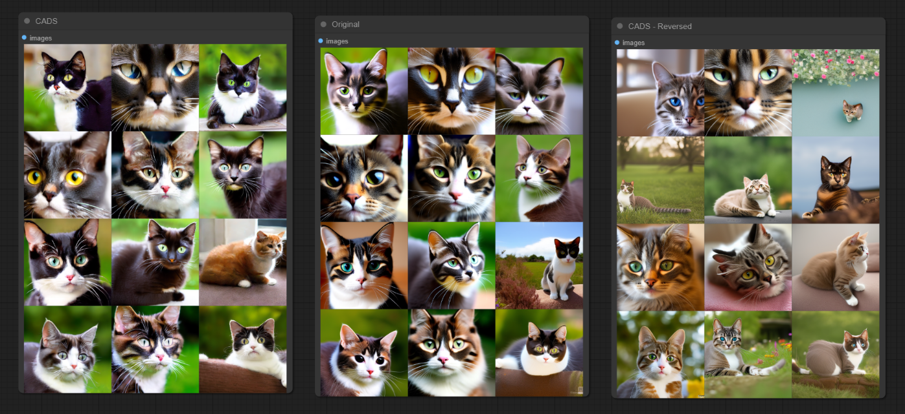
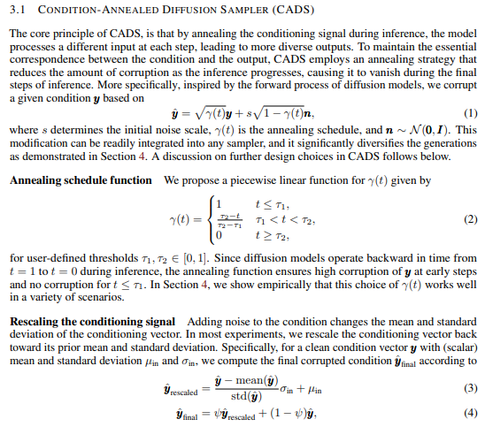
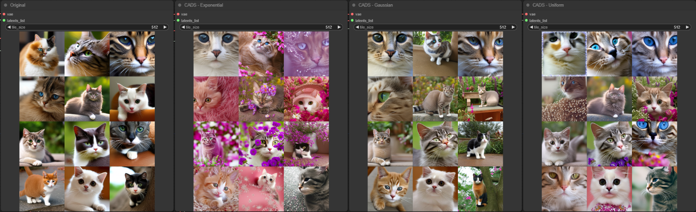

# ComfyUI CADS Experimental Implementation

This node aims to enhance the model's output diversity by introducing noise during the sampling process, based on the CADS method outlined in this [paper](https://arxiv.org/abs/2310.17347) specifically for ComfyUI.

Forked from [asagi4/ComfyUI-CADS](https://github.com/asagi4/ComfyUI-CADS), this implementation also acknowledges the [A1111 approach](https://github.com/v0xie/sd-webui-cads/tree/main) as an instrumental reference.

## How to Use

After initializing other nodes that set a unet wrapper function, apply this node. It maintains existing wrappers while integrating new functionalities.

- `t1`: Original prompt conditioning.
- `t2`: Noise injection (Gaussian noise) adjusted by `noise_scale`.
- `noise_scale`: Modulates the intensity of `t2`. Inactive at `0`.
- `noise_type`: The type of the noise distribution.
- `reverse_process`: Reverses the noise injection sequence.
- `rescale_psi`: Normalizes the noised conditioning. Inactive at `0`.
- `apply_to`: Targets noise application, with `uncond` as the default.
- `key`: Determines which prompt undergoes noise addition.

The transition between `t1` and `t2` is dynamically managed based on their values, ensuring a smooth integration of the original and noised conditions.

Recommendations from the paper:
- `t1` set to `0.2` introduces excessive noise, while `0.9` is minimal.
- Suggested `noise_scale` ranges from `0.025` to `0.25`.
- `rescale_psi`: A higher value, optimally `1`, reduces divergence risks and can improve output quality. However, empirical evidence suggests that the optimal setting for `rescale_psi` can be task-dependent. While `1` tends to generate results closer to the original distribution, setting it to `0` can sometimes provide better outcomes, though this is not consistently the case.
- `reverse_process`: Dictates the diversity control mechanism. Setting it to `True` initiates noise application, fostering overall image diversity. Conversely, `False` starts with the prompt, integrating noise subsequently, which primarily alters details.

In addition to the normal distribution used for conditioning corruption in the paper, this implementation offers alternative options to cater to varying levels of desired output diversity:

- `Gaussian`: Employs normal distribution, preserving a degree of the original composition's structure.
- `Uniform`: Generates more diversity than Gaussian by ensuring an even spread from the mean, potentially leading to nonsensical results.
- `Exponential`: Delivers extreme diversity by markedly diverging from the mean, which may also result in nonsensical outcomes.

## Known Issues

Initially applied to cross-attention, noise application has been shifted to regular conditioning `y` for improved relevance. Alter the `key` parameter to revert to the previous mechanism. Presently, the term `attention` is observed within the model's structure.
